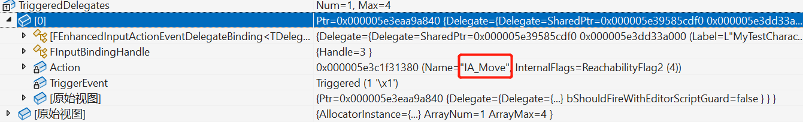

# AController

在创建人物移动时，会绑定移动的逻辑。
```c++
// Jumping
EnhancedInputComponent->BindAction(JumpAction, ETriggerEvent::Started, this, &ACharacter::Jump);
EnhancedInputComponent->BindAction(JumpAction, ETriggerEvent::Completed, this, &ACharacter::StopJumping);

// Moving
EnhancedInputComponent->BindAction(MoveAction, ETriggerEvent::Triggered, this, &ATestCharacter::Move);

// Looking
EnhancedInputComponent->BindAction(LookAction, ETriggerEvent::Triggered, this, &ATestCharacter::Look);
```

绑定的函数会根据ETriggerEvent来分类，比如Trigger类的事件就会被添加到下面这个对象中。
```c++
static TArray<TUniquePtr<FEnhancedInputActionEventBinding>> TriggeredDelegates;
```



那么谁来控制人物的移动逻辑呢？
首先当按下w/a/s/d时，最先收到消息的是Controller，由Controller中的TickActor()函数来Tick输入，最后通过代理的方式走到Move函数。

计算完旋转/方向后，会使用函数`AddMovementinput()`函数传递。
输入会被CharacterMovementComponent中的ControlledCharacterMove()函数翻译成`Acceleration`，
