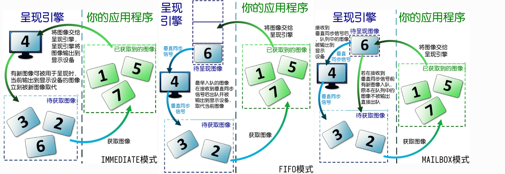

# Vulkan

## 画一个三角形

Vulkan 最显着的特性之一是 图形管线的几乎所有配置都需要提前设置。 这意味着，如果您想切换到不同的着色器或稍微切换到不同的着色器 更改顶点布局，然后您需要完全重新创建图形 管道。只有一些基础的配置，如视口大小和清晰的颜色可以动态更改

## 流程

Vulkan的NDC坐标范围：[0，1]，使用GLM_FORCE_DEPTH_ZERO_TO_ONE来指定深度范围

### vulkan初始化流程

一个呈现图像的Vulkan应用程序需经历以下的步骤以初始化：

#### 1.创建Vulkan实例

使用**vkCreateInstance()**创建**VkInstance**实例。函数需要**VkInstanceCreateInfo**实例

```c
VkResult vkCreateInstance(
    const VkInstanceCreateInfo*                 pCreateInfo,
    const VkAllocationCallbacks*                pAllocator,
    VkInstance*                                 pInstance);
```

`pCreateInfo`:指向VkInstanceCreateInfo数据结构对象
`pAllocator`:内存分配器，用nullptr表示使用内部默认分配器
`pInstance`:返回创建的VkInstance对象。

**VkInstanceCreateInfo**

```c
typedef struct VkInstanceCreateInfo {
    VkStructureType             sType;
    const void*                 pNext;
    VkInstanceCreateFlags       flags;
    const VkApplicationInfo*    pApplicationInfo;
    uint32_t                    enabledLayerCount;
    const char* const*          ppEnabledLayerNames;
    uint32_t                    enabledExtensionCount;
    const char* const*          ppEnabledExtensionNames;
} VkInstanceCreateInfo;
```

`sType`是该结构体的类型枚举值， **必须** 是 `VkStructureType::VK_STRUCTURE_TYPE_INSTANCE_CREATE_INFO` 。

`pNext` 要么是 `NULL` 要么指向其他结构体来扩展该结构体。

`flags` 是 `VkInstanceCreateFlagBits` 所表示的位域值，用于设置 `VkInstance` 的行为。

`pApplicationInfo` 要么是 `NULL` 要么指向应用信息结构体，用于应用细节设置。

`enabledLayerCount` 激活的 `layer` 数量。

`ppEnabledLayerNames` 指向数量为 `enabledLayerCount` 的 `layer` 字符串数组，用于设置要激活的 `layer`。

`enabledExtensionCount` 激活 `instance` 扩展的数量。

`enabledExtensionCount` 指向数量为 `enabledExtensionCount` 的扩展字符串数组，用于设置要激活的 `instance` 扩展。

```c
VkInstanceCreateInfo instanceCreateInfo = {
	.sType = VK_STRUCTURE_TYPE_INSTANCE_CREATE_INFO,
	.flags = flags,
	.pApplicationInfo = &applicatianInfo,
	.enabledLayerCount = uint32_t(instanceLayers.size()),
	.ppEnabledLayerNames = instanceLayers.data(),
	.enabledExtensionCount = uint32_t(instanceExtensions.size()),
	.ppEnabledExtensionNames = instanceExtensions.data()
};
```

**VkApplicationInfo**

```c
typedef struct VkApplicationInfo {
    VkStructureType    sType;
    const void*        pNext;
    const char*        pApplicationName;
    uint32_t           applicationVersion;
    const char*        pEngineName;
    uint32_t           engineVersion;
    uint32_t           apiVersion;
} VkApplicationInfo;
```

`sType`必须是**VkStructureType::Vk_STRUCTURE_TYPE_APPLICATION_INFO**
`apiVersion`:vulkan的版本

- `Vulkan 1.0` 主要提供光栅化图形和并行计算的功能。对应 `VK_API_VERSION_1_0` 。
- `Vulkan 1.1` 主要为 `Vulkan 1.0` 不完善的地方进行补全。对应 `VK_API_VERSION_1_1` 。
- `Vulkan 1.2` 主要提供硬件光追的功能。对应 `VK_API_VERSION_1_2` 。
- `Vulkan 1.3` 主要提供动态光栅化图形的功能。对应 `VK_API_VERSION_1_3` 。

对于版本号，可以使用**vkEnumerateInstanceVersion(uint32_t*  pApiVersion)**，获取支持的vulkan版本。

```c
vkEnumerateInstanceVersion(&apiVersion);
```


```c
VkApplicationInfo applicatianInfo = {
	.sType = VK_STRUCTURE_TYPE_APPLICATION_INFO,
	.apiVersion = apiVersion
};
```

**层/Layer**

在创建`VkInstanceCreateInfo`时，需要配置`enabledLayerCount`和`ppEnabledLayerNames`
层是用来做正确性验证和检查的。目前Vulkan支持的层如下：

- **VK_LAYER_KHRONOS_validation** `Vulkan API` 验证和错误检查。
- **VK_LAYER_LUNARG_gfxreconstruct** 使用 [GFXReconstruct](https://vulkan.lunarg.com/doc/view/1.3.275.0/windows/getting_started.html#vulkan-api-capture-and-replay-with-gfxreconstruct) 捕获应用的 `Vulkan` 指令。
- **VK_LAYER_LUNARG_api_dump** 输出调用的 `API` 和传入的参数。
- **VK_LAYER_KHRONOS_profiles** 帮助测试硬件的性能，而不需要物理接触每个设备。该 `层` 将会覆盖从 `GPU` 查询到的数据。
- **VK_LAYER_LUNARG_monitor** 在应用界面的标题处显示帧率。
- **VK_LAYER_LUNARG_screenshot** 将显示的画面帧输出到一个图片文件中。
- **VK_LAYER_KHRONOS_synchronization2** 使用系统实现的 `VK_KHR_synchronization2` 扩展，而不是驱动实现的。
- **VK_LAYER_KHRONOS_shader_object** 使用系统实现的 `VK_EXT_shader_object` 扩展，而不是驱动实现的。

其中最常使用的 `层` 就是 `VK_LAYER_KHRONOS_validation` ，用于 `Vulkan API` 验证和错误检查。

**vkEnumerateInstanceLayerProperties()**

可以通过这个函数来获取系统中vulkan支持的Layer

2.创建debug messenger（若编译选项为DEBUG）
3.创建window surface
4.选择物理设备并创建逻辑设备，取得队列
5.创建交换链


#### vulkan实例

应用程序必须显式地告诉操作系统，说明其需要使用Vulkan的功能，这一步是由创建Vulkan实例（VkInstance）来完成的。
Vulkan实例的底层是一系列Vulkan运行所必需的用于记录状态和信息的变量。

#### 物理设备和逻辑设备？

物理设备即图形处理器，通常为GPU。Vulkan中所谓的物理设备虽称物理（physical），但并非必须是实体设备。
VkPhysicalDevice类型指代物理设备，从这类handle只能获取物理设备信息。VkDevice类型是逻辑设备的handle，逻辑设备是编程层面上用来与物理设备交互的对象，关于分配设备内存、创建Vulkan相关对象的命令大都会被提交给逻辑设备。

#### 什么是队列？
队列（VkQueue）类似于线程，命令被提交到队列执行，[Vulkan官方标准](https://renderdoc.org/vkspec_chunked/chap3.html#fundamentals-queueoperation)中将队列描述为命令执行引擎的接口：
Vulkan核心功能中规定队列支持的操作类型包括图形、计算、数据传送、稀疏绑定四种，图形和计算队列必定也支持数据传送。一族功能相同的队列称为队列族。
任何支持Vulkan的显卡驱动确保你能找到**至少一个**同时支持图形和计算操作的队列族。

#### 交换链

在将一张图像用于渲染或其他类型的写入时，已渲染好的图像可以被呈现引擎读取，如此交替呈现在窗口中的数张图像的集合即为交换链。

#### 创建逻辑设备的步骤

创建逻辑设备的步骤依序为：
1.获取物理设备列表
2.检查物理设备是否满足所需的队列族类型，从中选择能满足要求的设备并顺便取得队列族索引
3.确定所需的设备级别扩展，不检查是否可用
4.用[vkCreateDevice](https://renderdoc.org/vkspec_chunked/chap5.html#vkCreateDevice)(...)创建逻辑设备，取得队列
5.取得物理设备属性、物理设备内存属性，以备之后使用

- 不检查扩展是否可用的原因同前文不检查实例级别层和扩展是否可用的原因相似，[vkCreateDevice](https://renderdoc.org/vkspec_chunked/chap5.html#vkCreateDevice)(...)本就会对扩展是否可用进行检查。
- 第5步的内容是以创建逻辑设备成功，确定将要使用的物理设备不再变动为前提的，若你对物理设备的性能有要求，也可以在第2步前自行取得各个物理设备的属性，进行甄选。

**根据情况，一共需要三种类型的队列：图形、呈现、计算。**
呈现队列并非是Vulkan核心功能中规定的队列类型。几乎可以肯定，GPU必定会有一个同时支持图形和呈现的队列族（该说法来自谷歌的搜索结果，我认为是准确的，考虑到没找到与此相悖的报告），但标准中并没有作此规定，因此保险起见，我将其单独列出来。

- 如果你的程序没有图形界面（比如，仅仅用于对图像做某种处理的控制台程序），那么呈现队列非必须。
- 如果你不需要GPU计算或间接渲染（将CPU上的一些计算扔到GPU上然后再从计算结果做渲染），那么计算队列非必须。
- 如果你只打算搞计算（GPU是高度并行的计算设备）而不搞渲染，那么图形队列非必须。

#### 创建交换链

创建交换链的步骤依序为：
1.填写一大堆信息
2.创建交换链并取得交换链图像，为交换链图像创建image view

**什么是image view？**
Vulkan中，VkImage引用一片[物理设备内存](https://easyvulkan.github.io/Ch3-2 图像与缓冲区.html#device-memory)，将该片内存上的数据用作图像，而VkImageView指定图像的使用方式，比如，一个6层的二维图像，可以用作6层的二维图像数组，也可用作天空盒。

#### 呈现模式

- VK_PRESENT_MODE_IMMEDIATE_KHR表示立即模式，该模式下不限制帧率且帧率在所有模式中是最高的。该模式不等待垂直同步信号，一旦图片渲染完，用于呈现的图像就会被立刻替换掉，这可能导致画面撕裂。
- VK_PRESENT_MODE_FIFO_KHR表示先入先出模式，该模式限制帧率与屏幕刷新率一致，这种模式是必定支持的。在该模式下，图像被推送进一个用于待呈现图像的队列，然后等待垂直同步信号，按顺序被推出队列并输出到屏幕，因此叫先入先出。
- VK_PRESENT_MODE_FIFO_RELAXED_KHR同VK_PRESENT_MODE_FIFO_KHR的差别在于，若屏幕上图像的停留时间长于一个刷新间隔，呈现引擎可能在下一个垂直同步信号到来前便试图将呈现队列中的图像输出到屏幕，该模式相比VK_PRESENT_MODE_FIFO_KHR更不容易引起阻塞或迟滞，但在帧率较低时可能会导致画面撕裂。
- VK_PRESENT_MODE_MAILBOX_KHR是一种类似于三重缓冲的模式。它的待呈现图像队列中只容纳一个元素，在等待垂直同步信号期间若有新的图像入队，那么旧的图像会直接出队而不被输出到屏幕（即出队不需要等待垂直同步信号，因此不限制帧率），出现在屏幕上的总会是最新的图像。



#### 栅栏和信号量

栅栏fence在渲染完成后被置位。开始录制命令缓冲区需要在cpu一侧手动等待fence被置位以确保先前的命令已完成执行，

#### 命令池和命令缓冲区

````c++
commandBuffer cmdBuffer;
commandPool cmdPool(graphicsBase::Base().QueueFamilyIndex_Graphics(), VK_COMMAND_POOL_CREATE_RESET_COMMAND_BUFFER_BIT);
//分配命令缓冲区
cmdPool.AllocateBuffers(cmdBuffer);

````


### 顶点着色器 vertex shader

**gl_VertexIndex**是顶点着色器的内置输入，**gl_Position**是顶点着色器的内置输出，代表生成图元的顶点坐标，无需声明直接使用


### 片段着色器 fragment shader


### 创建着色器模组

填充**CreatePipeline()**，以函数内静态变量的形式创建着色器模组，以及它们对应的管线阶段创建信息

```c
void CreatePipeline()
{
	static shaderModule vert();
	static shaderModule frag();
	static VkPipelineShaderStageCreateInfo shaderCreateInfo[2] = 
	{
		vert.StageCreateInfo(VK_SHADER_STAGE_VERTEX_BIT),
		frag.StageCreateInfo(VK_SHADER_STAGE_FRAGMENT_BIT)
	
	};

}
```


### 创建管线布局

```c++
void CreateLayout() {
    VkPipelineLayoutCreateInfo pipelineLayoutCreateInfo{};
    pipelineLayout_triangle.Create(pipelineLayoutCreateInfo);
}
```


### 创建管线

管线**VkPipeline**是处理数据流程的抽象，它由可编程着色器阶段，固定管线阶段以及一系列状态参数构成
用**vkCreateGraphicsPipelines()**创建图形管线


### 绑定管线

使用**vkCmdBindPipeline()**绑定管线


### 绘制

使用**vkCmdDraw()**，它适用于直接绘制（而不是从缓冲区读取绘制参数）且不需要索引缓冲区的情况。


## 基础

### 缓冲区

缓冲区**VkBuffer**引用设备内存，指代缓冲区数据，缓冲区中的数据是线性排列的， **vkCreateBuffer()**创建缓冲区

### 缓冲区视图

**VkBufferView**定义了将纹素作为1D图像的使用方法。**vkCreateBufferView()**创建缓冲区视图

### 图像

**VkImage**引用设备内存，指代图像数据。图像同缓冲区的不同之处是，图像具有格式和内存布局，也就意味着其中的数据未必是线性排列的。**vkCreateImage()**创建图像

### Staging Buffer

暂存缓冲区/临时缓冲区，用于充当主机和GPU之间的桥梁。他是在显存上开辟的。

- 在GPU申请一块内存，并设置为主机可见（可以映射其地址）
- 把CPU端内存中存放的目标数据拷贝到staging buffer中
- 创建另一个相同大小的显存块，对主机不可见
- 从staging buffer拷贝数据到该buffer中
- 删除主机可见的staging buffer
- 使用这块显存来渲染

### 顶点缓冲区

1.创建一个暂存缓冲区（staging buffer），具有VK_MEMORY_PROPERTY_HOST_VISIBLE_BIT内存属性（CPU侧可读写，但对GPU而言读取效率并非最佳）
2.映射内存区后，用memcpy(...)将顶点数据拷贝到暂存缓冲区
3.创建一个顶点缓冲区，具有VK_MEMORY_PROPERTY_DEVICE_LOCAL_BIT内存属性（对GPU侧读写效率最佳）
4.用[vkCmdCopyBuffer](https://renderdoc.org/vkspec_chunked/chap20.html#vkCmdCopyBuffer)(...)将数据从暂存缓冲区拷贝到顶点缓冲区
5.创建管线时，书写顶点属性
6.书写新的顶点着色器
7.在命令缓冲区中绑定顶点缓冲区并绘制

```c
//创建顶点缓冲区
vertex vertices[] = {
    { {  .0f, -.5f }, { 1, 0, 0, 1 } },//红色
    { { -.5f,  .5f }, { 0, 1, 0, 1 } },//绿色
    { {  .5f,  .5f }, { 0, 0, 1, 1 } } //蓝色
};
vertexBuffer vertexBuffer(sizeof vertices);
vertexBuffer.TransferData(vertices);
//绑定顶点缓冲区
VkDeviceSize offset = 0;
vkCmdBindVertexBuffers(commandBuffer, 0, 1, vertexBuffer.Address(), &offset);
```

### 索引缓冲区

索引绘制（indexed draw），是在绘制时根据索引缓冲区（index buffer）中的索引值取得相应顶点数据的绘制方式。
相比只用顶点缓冲区进行绘制的方式，这么做得以在需要提供相同的顶点数据时，**复用同一组数据。**

### 实例化索引

```c
//对于这样的顶点数据
vertex vertices[] = {
    { {  .0f, -.5f }, { 1, 0, 0, 1 } },
    { { -.5f,  .5f }, { 0, 1, 0, 1 } },
    { {  .5f,  .5f }, { 0, 0, 1, 1 } },
    //左移0.5
    { {  .0f - .5f, -.5f }, { 1, 0, 0, 1 } },
    { { -.5f - .5f,  .5f }, { 0, 1, 0, 1 } },
    { {  .5f - .5f,  .5f }, { 0, 0, 1, 1 } },
    //右移0.5
    { {  .0f + .5f, -.5f }, { 1, 0, 0, 1 } },
    { { -.5f + .5f,  .5f }, { 0, 1, 0, 1 } },
    { {  .5f + .5f,  .5f }, { 0, 0, 1, 1 } }
};

我们可以把位置和偏移分开
vertex vertices[] = {
    { {  .0f, -.5f }, { 1, 0, 0, 1 } },
    { { -.5f,  .5f }, { 0, 1, 0, 1 } },
    { {  .5f,  .5f }, { 0, 0, 1, 1 } }
};
glm::vec2 offsets[] = {
    { {  .0f, .0f } },
    { { -.5f, .0f } },
    { {  .5f, .0f } }
};

```

若称每个基于**vertices**绘制的三角形为一个实例（instance），每个三角形的序号为实例索引（instance index），单个三角形中每个顶点的序号为顶点索引（vertex index），则绘制3个三角形实例的全部9个顶点时，`vertex[顶点索引].positions + offsets[实例索引]`即为其中单个顶点的坐标。

### Push Constant

Push constant是在着色器中使用可由CPU侧变更的常量的最简单方式。管线能使用的push constant常量的大小为128B

### Uniform缓冲区

Uniform缓冲区的优势在于其大小可以比较大（具体大小取决于硬件，若要更大，应当使用storage缓冲区）。
更新uniform缓冲区时，若数据量较大，那么需要使用[vkCmdCopyBuffer](https://renderdoc.org/vkspec_chunked/chap20.html#vkCmdCopyBuffer)(...)从暂存缓冲区拷贝数据，这一行为要么在单独的（与绘制无关）的命令缓冲区中进行，要么在渲染通道前进行并使用内存屏障进行同步。若数据量小于等于65536个字节，那么无需暂存缓冲区，可以用[vkCmdUpdateBuffer](https://renderdoc.org/vkspec_chunked/chap19.html#vkCmdUpdateBuffer)(...)直接更新（仍旧需要同步）。
Uniform缓冲区需要通过描述符使用而不能直接绑定，相比之下比较费事。

使用顶点和uniform缓冲区绘制三角形需要经历以下步骤：
1.创建uniform缓冲区
2.创建描述符布局和管线布局
3.创建描述符
4.将uniform缓冲区的信息写入描述符
5.书写着色器
6.在命令缓冲区中绑定描述符并绘制

#### 1.创建Uniform缓冲区

```c
glm::vec2 uniform_positions[] = {
    {  .0f, .0f }, {},
    { -.5f, .0f }, {},
    {  .5f, .0f }, {}
};
uniformBuffer uniformBuffer(sizeof uniform_positions);
uniformBuffer.TransferData(uniform_positions);
```

着色器中uniform缓冲区的[内存布局](https://easyvulkan.github.io/Ch4-1 着色器模组.html#id15)只能为std140，由于C++中vec2的大小和对齐是8，凑整到16为16，于是需要在每个数组成员后再放一个vec2作为空数据以满足对其要求。

#### 2.创建描述符布局和管线布局

```c
descriptorSetLayout descriptorSetLayout_triangle;
```

填写VkDescriptorSetLayoutBinding结构体，创建描述符布局信息
```c
VkDescriptorSetLayoutBinding descriptorSetLayoutBinding_trianglePosition = {
    .binding = 0,                                       //描述符被绑定到0号binding
    .descriptorType = VK_DESCRIPTOR_TYPE_UNIFORM_BUFFER,//类型为uniform缓冲区
    .descriptorCount = 1,                               //个数是1个
    .stageFlags = VK_SHADER_STAGE_VERTEX_BIT            //在顶点着色器阶段读取uniform缓冲区
};
VkDescriptorSetLayoutCreateInfo descriptorSetLayoutCreateInfo_triangle = {
    .bindingCount = 1,
    .pBindings = &descriptorSetLayoutBinding_trianglePosition
};
descriptorSetLayout_triangle.Create(descriptorSetLayoutCreateInfo_triangle);
```

#### 创建描述符

首先创建描述符池`VkDescriptorPoolSize`，
```c
VkDescriptorPoolSize descriptorPoolSizes[] = {
    { VK_DESCRIPTOR_TYPE_UNIFORM_BUFFER, 1 }
};
descriptorPool descriptorPool(1, descriptorPoolSizes);
```

分配描述符集
````c
descriptorSet descriptorSet_trianglePosition;
descriptorPool.AllocateSets(descriptorSet_trianglePosition, descriptorSetLayout_triangle);
````

把uniform缓冲区的信息写入描述符
```c
VkDescriptorBufferInfo bufferInfo = {
    .buffer = uniformBuffer,
    .offset = 0,
    .range = sizeof uniform_positions//或VK_WHOLE_SIZE
};
descriptorSet_trianglePosition.Write(bufferInfo, VK_DESCRIPTOR_TYPE_UNIFORM_BUFFER);
```

### 采样器 Sampler

采样器`VkSampler`用于指定采样方式。采样方式包括如何读取图像数据、滤波方式，以及一系列其他变换，使用不同的采样器以满足对图像的不同使用要求。使用`VkCreateSampler`创建采样器。


## 指令

`Vulkan` 标准中提供了一系列的接口函数，其中有一部分函数将会作为 `指令` 通过 `CPU` 记录在 `指令容器` 中，之后可以将 `指令容器` 推送到 `GPU` 中执行。

这种在 `CPU` 记录，在 `GPU` 上执行的函数叫做 `指令` 。在vulkan中指令以`vkCmd...`格式。
