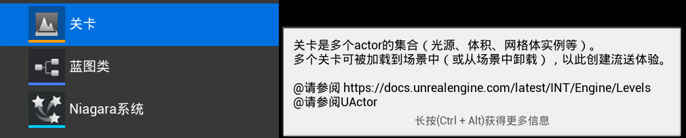

# UWorld

## 什么是World

The World is the top level object representing a map or a sandbox in which Actors and Components will exist and be rendered.  
 * A World can be a single Persistent Level with an optional list of streaming levels that are loaded and unloaded via volumes and blueprint functions
 * or it can be a collection of levels organized with a World Composition.
 * In a standalone game, generally only a single World exists except during seamless area transitions when both a destination and current world exists.
 * In the editor many Worlds exist: The level being edited, each PIE instance, each editor tool which has an interactive rendered viewport, and many more.

`UWorld`是最终类，不可以被继承。

```c++
UCLASS(customConstructor, config=Engine)
class ENGINE_API UWorld final : public UObject, public FNetworkNotify{};
```

World是由一个或者多个Level组成的

## ULevel

A Level is a collection of Actors (lights, volumes, mesh instances etc.).
 * Multiple Levels can be loaded and unloaded into the World to create a streaming experience.



每一个Level都包含了自己的URL，Actors。

```c++
class ULevel : public UObject, public IInterface_AssetUserData, public ITextureStreamingContainer, public IEditorPathObjectInterface
{
	/** URL associated with this level. */
	FURL					URL;

	/** Array of all actors in this level, used by FActorIteratorBase and derived classes */
	TArray<TObjectPtr<AActor>> Actors;
};
```

每一个Level都有自己的运行规则
```c++
private:
UPROPERTY()
TObjectPtr<AWorldSettings> WorldSettings;
```

同时Level还支持蓝图逻辑编写
```
/** Reference to the blueprint for level scripting */
UPROPERTY(NonTransactional)
TObjectPtr<class ULevelScriptBlueprint> LevelScriptBlueprint;
```

既然一个World可以包含Level，那么我们也可以知道是是谁包含了这个Level
```
UPROPERTY(Transient)
TObjectPtr<UWorld> OwningWorld;
```

通过函数`GetWorld()`获取这个Level的世界信息。

